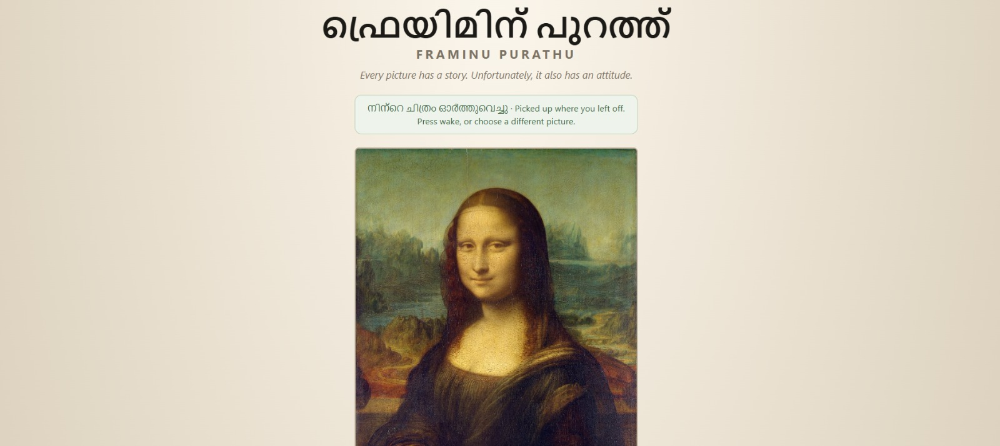
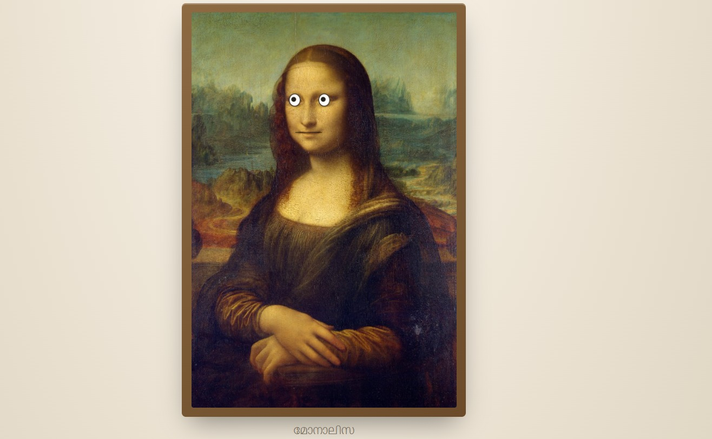
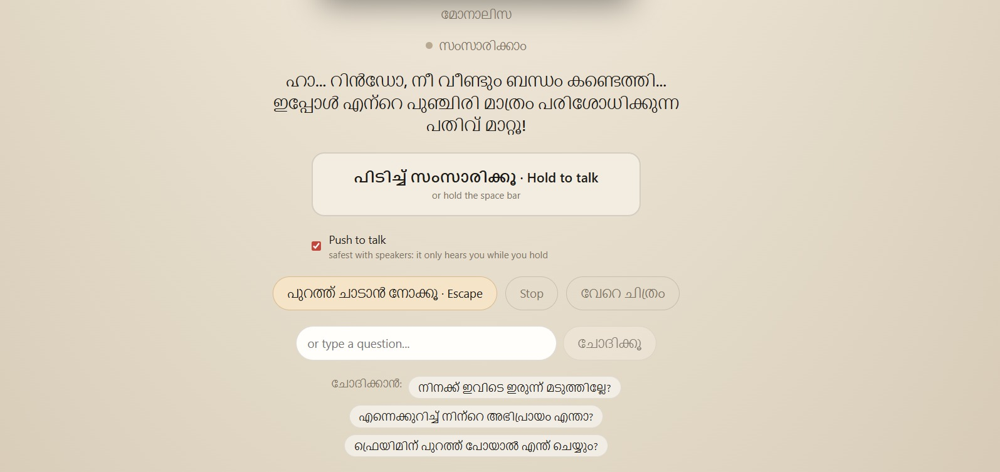

# ഫ്രെയിമിന് പുറത്ത് · Framinu Purathu 🎯

## Basic Details

### Team Name: CusCus

### Team Members

- Team Lead: Athul Krishna - College of Engineering Chengannur

- Member 2: Rinto Cherian - College of Engineering Chengannur

### Project Description

Upload a photograph and whatever is in it becomes a character you can argue with
out loud. A vision model looks at your picture, invents a personality from what
it actually sees, and then talks back in Malayalam with a cartoon mouth moving in
time with its speech. It is annoyed about being trapped in a picture, and it
insults you about it.

The design premise: this is not an AI assistant sitting next to a picture. **The
picture is the character.**

### The Problem (that doesn't exist)

Photographs have been sitting in our galleries for decades in total silence,
holding the same pose, saying nothing. Nobody has ever asked how the appam feels
about being photographed instead of eaten. Nobody has checked whether the Mona
Lisa is tired. Nobody has considered that your plastic chair has four legs and
still cannot walk out of the frame.

Worse: nobody has ever been roasted in fluent Malayalam by their own furniture.
A gap in the human experience.

### The Solution (that nobody asked for)

We gave the photograph a mouth, a grievance, and opinions about your
photography.

You hold the space bar and talk. It listens, thinks, and answers aloud in
Malayalam — in character, in under twenty words, with theatrical pauses for comic
timing. Go quiet for twenty seconds and it starts prodding you unprompted,
escalating three times before giving up on you entirely. Press the escape button
and it lunges at the edge of the frame, bounces off, and complains about that
too.

It also mixes English into its Malayalam the way Malayalis actually speak, which
took an unreasonable amount of engineering:

> എന്റമ്മോ... പുറത്തുപോകാൻ **permission** ഇല്ല, എന്റെ **freedom** ഫോട്ടോ സൈസ്!

An uploaded Mona Lisa, asked who painted her:

> ഓഹോ... എന്നെ വരച്ചത് ലിയോനാർദോ ദാ വിഞ്ചി, ഇനി ചോദ്യം തീർന്നോ പ്രിയമേ!

A photo of a plastic chair, unprompted:

> നാല് കാലുകളുണ്ടായിട്ടും ഈ ചിത്രത്തിൽനിന്ന് ഒരടി പോലും നടക്കാനാകുന്നില്ല
> *(Four legs, and still can't walk one step out of this picture)*

## Technical Details

### Technologies/Components Used

For Software:

- **Languages used:** TypeScript 5.9 (strict), JavaScript (ESM), CSS, HTML

- **Frameworks used:** React 18.3, Vite 6.4, Express 4.22, Node 22

- **Libraries used:**
  - `@azure/ai-voicelive` 1.1 — realtime speech-to-speech session
  - `ws` 8.21 — WebSocket bridge between browser and server
  - `redis` (node-redis) 6.2 — character card and transcript persistence
  - `react` / `react-dom` 18.3 — UI
  - `dotenv` — configuration
  - Web Audio API, AudioWorklet, SVG — capture, playback and animation, no
    animation library

- **AI services used:**

  | Role | Service | Model |
  |---|---|---|
  | Speech recognition + conversation | Azure AI Foundry Voice Live | `gpt-realtime-2.1` |
  | Malayalam speech synthesis | Sarvam AI | `bulbul:v3`, voices `tarun` / `roopa` |
  | Image understanding | Azure AI Foundry | `gpt-5.6-sol` |
  | Fallback synthesis | Azure Speech TTS | `ml-IN-MidhunNeural` / `ml-IN-SobhanaNeural` |

- **Tools used:** Redis, Git, VS Code, 21 throwaway diagnostic spike scripts kept
  in `spike/` as evidence for the provider decisions

Deliberately **not** used: no state manager, no UI kit, no animation library, no
vector database, no RAG, no agent framework, no 3D engine, no video generation.

For Hardware:

- **None.** This is a software-only project. It needs a laptop with a microphone
  and speakers, and headphones are strongly recommended — without them the
  character hears itself through the speakers, interrupts itself, and argues with
  itself. Funny once, then unusable.

### Implementation

For Software:

# Installation

Requires **Node 22** (`npm run dev:server` uses `node --watch`, which is only
stable there) and an Azure AI Foundry resource in a region that supports the
Voice Live API.

```bash
npm install

# Windows
copy .env.example .env
# macOS / Linux
cp .env.example .env
```

Fill in `.env`. The minimum to get talking:

```
AZURE_VOICELIVE_ENDPOINT=https://<your-resource>.services.ai.azure.com/
AZURE_VOICELIVE_API_KEY=<resource key>
AZURE_VISION_ENDPOINT=<foundry inference endpoint>
AZURE_VISION_API_KEY=<key>
SARVAM_API_KEY=<sarvam key>
```

Redis is optional. With it running, characters survive a server restart; with it
stopped, everything degrades gracefully to the previous behaviour.

# Run

```bash
npm run dev
```

Open http://localhost:5173, upload a picture or tap the Mona Lisa, drag the mouth
onto the subject, then press **ജീവൻ കൊടുക്കൂ · Wake it up** and hold space to
talk.

```bash
npm run build          # typecheck + production build
node spike/06-server-smoke.mjs   # end-to-end test, no microphone needed
node spike/07-phase2-smoke.mjs   # upload -> character card -> speaking character
```
## Live link, and why it is a landing page

## Live link

**Source URL submitted in the HubApp:** https://framinu-purathu.vercel.app/

This is a frontend-only build, deployed on the guidance of the TinkerHub
coordinators and mentors for the event, who asked that every team submit a working
link. It shows the interface and the design. The conversation itself runs on a Node
server that cannot be made public, so the talking part is not live at that URL.

Three things stand in the way of hosting the whole thing: the realtime model is
capped at 10 requests per minute, so one conversation is one session and a handful
of simultaneous visitors would exhaust it; there is no authentication, and a public
URL would put an unauthenticated endpoint in front of live API credentials; and the
backend holds an open provider session with per-connection timers for the length of
each conversation, which needs an ordinary long-lived Node host rather than a
serverless one. A self-sufficient frontend is not an option either — Azure Voice
Live cannot mint short-lived browser credentials from a long-lived key, so the keys
have to stay server-side and the browser stays a thin audio client that sends and
plays PCM16 frames.

For the real thing: the demo video shows a full conversation, and `npm run dev` has
it running locally in about a minute.


**Landing PAGE URL:** https://rinpoche-06.github.io/Framinu-Purattu/ — a static landing
page, not a running instance of the app.

That is deliberate, and worth explaining rather than glossing over. This app
cannot sit behind a public URL as it stands, for four reasons in increasing order
of how hard they are to remove.

**The realtime model is capped at 10 requests per minute.** One conversation is
one session, so ten strangers connecting inside the same minute start getting
failures. Deploying does not make that scale — it only makes the ceiling
reachable by people we cannot coordinate with.

**There is no authentication.** A public URL would put an unauthenticated
endpoint directly in front of live API credentials. Before it could be shared it
needs a concurrency cap, per-IP rate limiting, and a reserved slot for whoever is
presenting.

**`getUserMedia` requires a secure context.** Microphone access works on
`localhost` and over HTTPS, but not over a plain LAN address — so "just open it on
your phone" does not work without real hosting or a tunnel.

**The backend needs a long-lived process.** It holds an open provider session,
per-connection timers, and a synthesis chain that lives for the whole
conversation. Serverless platforms are the wrong shape for that; this needs an
ordinary Node host.

There is also no frontend-only version to deploy, which is the part people assume
is possible. Azure Voice Live cannot mint short-lived browser credentials from a
long-lived key — there is no token exchange — so the browser can never talk to
the provider directly. Every credential lives on the Node server and the browser
is a thin audio client that sends and plays PCM16 frames. Shipping the key to the
client would publish a permanent secret to every visitor, so a static deploy
would be a UI with nothing behind it.

So: the landing page explains the project, the demo video shows it working, and
`npm run dev` has the real thing running locally in about a minute.

### Project Documentation

For Software:

# Screenshots (Add at least 3)



*The landing screen, resuming a session. The notice reads നിന്റെ ചിത്രം
ഓർത്തുവെച്ചു — "picked up where you left off" — which is the `sessionStorage`
snapshot restoring the picture after a page reload, rather than dumping you back
at the file picker.*



*The character on stage, framed and named മോനാലിസ. The cartoon eyes and mouth are
SVG overlays drawn on top of the photograph — no video is generated per reply,
which is what keeps the conversation live. The eyes track your cursor with a
lightly damped spring and blink on their own.*



*A live conversation. The Malayalam caption grows sentence by sentence as the
character speaks; here it has just reconnected, so it addresses the user by name
and carries on the earlier exchange instead of reintroducing itself. Below:
push-to-talk held with the space bar, the Escape button that makes it lunge at
the frame edge, a type-a-question fallback for when the microphone is refused,
and clickable suggested questions.*

# Diagrams

```
BROWSER                          NODE SERVER                   PROVIDERS
-------                          -----------                   ---------
mic → AudioWorklet → PCM16 ────→ ws /realtime ──────────────→ Azure Voice Live
                                                               (STT + LLM, text out)
                                       │
                                       ├── reply text ───────→ Sarvam Bulbul v3
                                       │                        (Malayalam TTS)
speakers ← playback queue ←── binary PCM frames ←──────────────┘
              │
          AnalyserNode → RMS → mouth openness + body motion

                                 POST /api/analyse ──────────→ Azure vision model
                                 Redis ← character cards, transcripts
```

**Control plane** — a thin Node server holds the API keys, runs the realtime
session, proxies the vision call, and persists cards. **Voice plane** — one
persistent realtime session per conversation; the browser never talks to a
provider directly. **Presentation plane** — image plus SVG overlays, driven by an
`AnalyserNode` tapped off the actual playback node.

**Why the server exists:** the Azure key is long-lived and Voice Live cannot mint
short-lived browser credentials from it. Putting the key in client code would
ship a permanent secret to every visitor, so the session runs server-side and the
browser is a thin audio client. The production bundle is checked for key leakage
on every build.

For Hardware:

# Schematic & Circuit

*Not applicable — software-only project.*

# Build Photos

*Not applicable — software-only project.*

### Project Demo

# Video

https://drive.google.com/drive/folders/1Hc-7W2Kk7rXtzgSzoveOnbB19qZ5Dz4R?usp=sharing

## Team Contributions

- Athul Krishna: Backend, voice pipeline and AI integration — the Node server,
  provider evaluation, speech synthesis and the character prompts.

- Rinto Cherian: Frontend and presentation — the React client, mouth editor,
  audio capture and playback, and the animation.

---

## Notes for the curious

**The hard part was not the comedy, it was that realtime Malayalam voice barely
exists.** `gpt-realtime` does not list Malayalam. Gemini Live does not support it
at all. Azure has exactly two Malayalam voices, both Standard tier, no HD, no
emotion styles — and they cannot speak mixed Malayalam-English at all, which we
established across ten tested configurations. Sarvam's Bulbul v3 handles
code-mixing natively, which is why the character can speak Manglish. Determining
all of this took 21 spike scripts and 60-odd generated audio samples, kept in
`spike/` as evidence.

**Measured, not estimated:** first audio in 2946 ms on the Sarvam path (samples
3388 / 2951 / 2500), 3270 ms on the Azure path. Synthesising sentence by sentence
as text arrives rather than waiting for the whole reply took this down from
3911 ms. Roughly ₹0.30 per reply.

**This is audio-reactive animation, not lip-sync.** The mouth opens in time with
loudness; it does not form Malayalam visemes. The craft detail that makes it read
as alive is frequency separation — the mouth follows syllables (attack 0.55), the
body follows phrases (attack 0.08). Same signal, deliberately different time
constants. Matching them produces a vibrating puppet.

**Where the roasting stops.** Fair targets: talking to a photograph instead of
doing something useful, the quality of your questions, your lighting, your
impatience. Never targets: body, appearance, caste, religion, region, family,
gender, age, disability, money. That boundary is in the prompt and the character
cannot be talked out of it. Famous artworks get identified along with their
creator; private individuals are never named or given invented biography.

---

Made with ❤️ at TinkerHub Useless Projects


